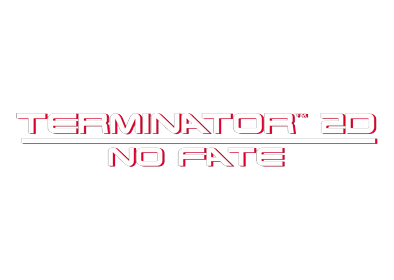
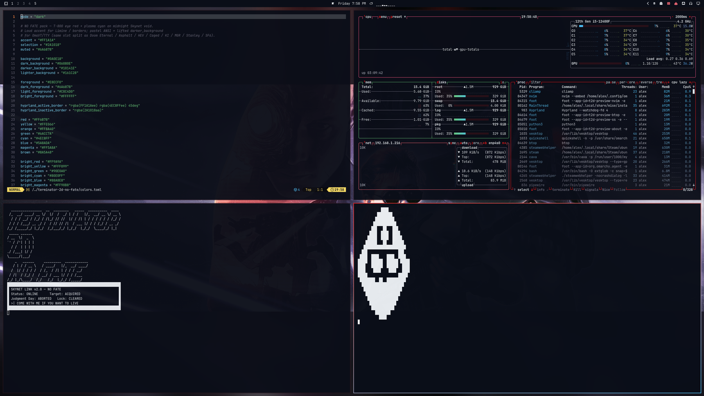
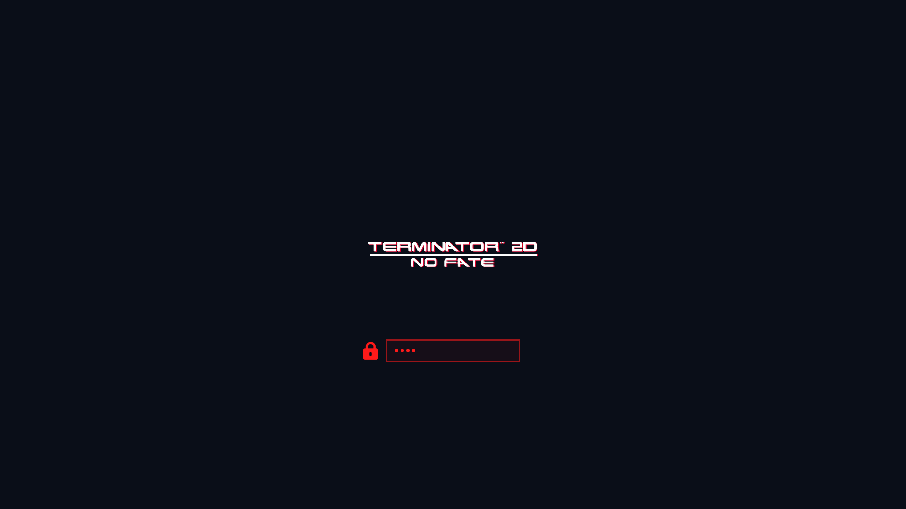

# Terminator 2D: NO FATE — Omarchy theme

There is no fate but what we make — and we made a theme. Based on the game.
Based on the movie. We hacked into Skynet for a bit, pulled the palette, tiled
the windows, and got out before Judgment Day noticed. John should be able to
destroy it in the future. Hopefully. For now we listen to FutureCast on our
hypr systems through cliamp while we tile everything. What if your desktop
matched Bitmap Bureau’s *Terminator 2D: NO FATE* **T-800 eye red → plasma
cyan** on a midnight Skynet void instead of another flat dark mode? Same
dual-accent border trick as Asphalt, HEV, Galuga, CS, Cyber Shadow, Doom 2016,
Eternal, Caged, KI, Rising, Stanley & SF6 — different timeline. No fate but
what we rice.

Arcade run-and-gun theme for [Omarchy](https://omarchy.org/). Inspired by the
look of *Terminator 2D: NO FATE* — **not affiliated with Bitmap Bureau, Reef
Entertainment, or the Terminator rights holders** (see
[Credits](#credits--legal-ish) below). Come with me if you want to live (and
install).

No Omarchy pack turned up. LaunchBox has a cinematic startup theme (not a
palette). Generic “Terminator” Windows skinpacks aren’t T2D. Wallhaven has
movie stills, not the game. Built from Steam library / trading-card profile
backgrounds the same way as
[Asphalt Legends](https://github.com/AlxWolfenstein97/omarchy-asphalt-legends-theme),
[HEV Suit](https://github.com/AlxWolfenstein97/omarchy-hev-suit-theme),
[Operation Galuga](https://github.com/AlxWolfenstein97/omarchy-operation-galuga-theme),
[Counter-Strike](https://github.com/AlxWolfenstein97/omarchy-counter-strike-theme),
[Cyber Shadow](https://github.com/AlxWolfenstein97/omarchy-cyber-shadow-theme),
[Doom 2016](https://github.com/AlxWolfenstein97/omarchy-doom-2016-theme),
[Doom Eternal](https://github.com/AlxWolfenstein97/omarchy-doom-eternal-theme),
[Half-Life Caged](https://github.com/AlxWolfenstein97/omarchy-half-life-caged-theme),
[Killer Instinct](https://github.com/AlxWolfenstein97/omarchy-killer-instinct-theme),
[Metal Gear Rising](https://github.com/AlxWolfenstein97/omarchy-metal-gear-rising-theme),
[Stanley Parable](https://github.com/AlxWolfenstein97/omarchy-stanley-parable-theme),
and
[Street Fighter 6](https://github.com/AlxWolfenstein97/omarchy-street-fighter-6-theme).

<p align="center">
  
</p>





## Install

```bash
omarchy theme install https://github.com/AlxWolfenstein97/omarchy-terminator-2d-no-fate-theme.git
# optional — About + screensaver ASCII for this theme (skippable; see Branding)
cp ~/.config/omarchy/themes/terminator-2d-no-fate/about.txt ~/.config/omarchy/branding/about.txt
cp ~/.config/omarchy/themes/terminator-2d-no-fate/screensaver.txt ~/.config/omarchy/branding/screensaver.txt
```

That clones **and** applies the theme (`omarchy-theme-set` runs inside
`theme install`). Do **not** follow with another `omarchy theme set` — a second
set skips the first wallpaper and just wastes a switch. Fate doesn’t loop
unless you make it.

Or clone into place (then you *do* need an explicit set):

```bash
git clone https://github.com/AlxWolfenstein97/omarchy-terminator-2d-no-fate-theme.git ~/.config/omarchy/themes/terminator-2d-no-fate
omarchy theme set "Terminator 2D No Fate"
# optional branding — same as above
cp ~/.config/omarchy/themes/terminator-2d-no-fate/about.txt ~/.config/omarchy/branding/about.txt
cp ~/.config/omarchy/themes/terminator-2d-no-fate/screensaver.txt ~/.config/omarchy/branding/screensaver.txt
```

Already installed and just switching back later:

```bash
omarchy theme set "Terminator 2D No Fate"
# optional — re-apply this theme’s About / screensaver marks
cp ~/.config/omarchy/themes/terminator-2d-no-fate/about.txt ~/.config/omarchy/branding/about.txt
cp ~/.config/omarchy/themes/terminator-2d-no-fate/screensaver.txt ~/.config/omarchy/branding/screensaver.txt
```

Cycle wallpapers with `omarchy theme bg next`. Keep FutureCast in cliamp.
Keep tiling. The rest is resistance.

## What’s in the pack

| Asset | Role |
|-------|------|
| `colors.toml` | Palette (the real theme) |
| `backgrounds/` | HUD-less / logo-free wallpapers |
| `unlock.png` / `preview-unlock.png` | Plymouth unlock + picker mockup |
| `preview.png` | Theme switcher preview |
| `icon.txt` / `logo.txt` (+ `about.txt` / `screensaver.txt`) | About & screensaver **ASCII** branding |
| `icon.png` / `logo.png` | Same marks as images (README + optional “Set From Image”) |

### Branding (About / screensaver)

**Optional.** Omarchy’s About screen and screensaver read from
`~/.config/omarchy/branding/`. Shipping per-theme `.txt` marks isn’t original —
other Omarchy 3.x themes did it — but it’s the fast path if you want *this*
pack’s wordmark on idle and on About without hunting files. Skynet Link status
on the screensaver; triple-triangle lives glyph on About. Optional means
optional — no fate but what you `cp`.

**Prefer the `.txt` files** and the `cp` lines in [Install](#install). That’s
what you’re meant to see. Editing the text also works (Style → About /
Screensaver → Edit Text).

**Skip the `cp` if you already have custom logos / screensaver art you care
about** — or back those up first. The branding slot is really meant for *your*
marks (put personal art somewhere easy to reach). The Style file picker works,
but drilling into `~/.config/omarchy/themes/...` is slow busywork for something
optional. Don’t feel obliged to bring mine. John’s future is more important
than my ASCII.

The `.png` versions are here for the README and for a quick Style → **Set From
Image** try. In my experience Omarchy’s image→ASCII path is a bit thinicky on
color and boxing, so don’t expect magic from the PNGs — the hand text is the
good path.

Screensaver / logo ASCII is a dense **TERMINATOR / 2D / NO FATE** wordmark plus
a Skynet Link status panel (no empty lines). About / icon is the triple-triangle
lives glyph (same silhouette DNA as the in-game counter, no empty lines).

### Unlock

Style → Unlock → pick this theme (`unlock.png` / `preview-unlock.png`).
Password field in eye-red. Come with me if you want to unlock.

## Extend further with plugins

This repo is **palette + assets** on purpose. Omarchy already colour-coordinates
the shell, terminals, and editor from `colors.toml`. The plugins below push that
idea as far as it can reasonably go — optional extenders, not required theme
baggage. Themes keep working without them; authors can stick to the snappier
stock pipeline if they prefer. Hack the periphery if you want. John handles
the core later.

They do **not** depend on each other. Pick what you want; run the whole
inch-a-lada if you want the desktop to feel like yours. cliamp FutureCast in
one terminal, btop in another, tile until the machines blink first.

### The big sweep

| Plugin | What it themes |
|--------|----------------|
| **[Chroma](https://github.com/AlxWolfenstein97/chroma)** | GTK3 / GTK4 / libadwaita + Qt |
| **[OmaOBS](https://github.com/AlxWolfenstein97/omaobs)** | OBS Studio (real Yami `Omarchy.ovt`) |
| **[OmaCursor](https://github.com/AlxWolfenstein97/omacursor)** | Pointer / Adwaita XCursor recolor (+ optional SDDM) |
| **[OmaHud](https://github.com/AlxWolfenstein97/omahud)** | MangoHud colours only — live in-game retint |
| **[OmaBoot](https://github.com/AlxWolfenstein97/omaboot)** | Limine boot menu colours |
| **[OmaVT](https://github.com/AlxWolfenstein97/omavt)** | Virtual console / TTY palette |
| **[OmaTTY](https://github.com/AlxWolfenstein97/omatty)** | Console font (Terminus-first, accessibility) |

**Boom-in — one paste.** `--enable --yes` skips the per-plugin clone/enable
prompts; arm-all then arms deps + Style/theme-set + root/SDDM/DRM (no Y/n).
Omit any `plugin add` line you do not want; arm-all only touches what is
installed. Sudo may ask once — that is the boom, not a menu. Not Judgment Day.

```bash
omarchy plugin add https://github.com/AlxWolfenstein97/chroma.git --enable --yes
omarchy plugin add https://github.com/AlxWolfenstein97/omaobs.git --enable --yes
omarchy plugin add https://github.com/AlxWolfenstein97/omacursor.git --enable --yes
omarchy plugin add https://github.com/AlxWolfenstein97/omahud.git --enable --yes
omarchy plugin add https://github.com/AlxWolfenstein97/omaboot.git --enable --yes
omarchy plugin add https://github.com/AlxWolfenstein97/omavt.git --enable --yes
omarchy plugin add https://github.com/AlxWolfenstein97/omatty.git --enable --yes
~/.config/omarchy/plugins/io.github.alxwolfenstein97.chroma/tools/arm-all-family.sh
```

**Boom-out — one paste.** Mirror: teardown + pkg drop best-effort + plugin remove.
Abort mission. Clean exit.

```bash
~/.config/omarchy/plugins/io.github.alxwolfenstein97.chroma/tools/wipe-all-family.sh
```

**Piece-meal** (not boom): one plugin’s Workshop paste — `plugin add` + interactive
`install.sh` (asks [Y/n]) — lives on that plugin’s GitHub README. Single-plugin
full wipe: `…/<plugin>/uninstall.sh --yes`.

### Already solved elsewhere (gladly)

- **[Omacord](https://github.com/ASwenia/omacord)** — Vesktop / Vencord Discord
  follows Omarchy themes live:  
  `omarchy plugin add https://github.com/ASwenia/omacord --enable`

### Agent / desktop bridge

- **[OMCP](https://github.com/btsouth/omarchy-omcp)** — MCP desktop bridge:  
  `omarchy plugin add https://github.com/btsouth/omarchy-omcp --enable`

Browse more on the [Omarchy Plugins](https://plugins.omarchy.org/) site.

## Taste

Colours and contrast are tuned for what I like to look at — loud red, cold
void, cyan when the plasma hits. If they feel wrong for you, fork and retune
`colors.toml` without guilt. There is no fate but what we hex.

## Credits / legal-ish

- Visual inspiration and reference art from **Bitmap Bureau** / **Reef
  Entertainment**’s *Terminator 2D: NO FATE* branding and marketing (Steam
  library hero / logo, Steam trading-card profile backgrounds). **Not
  affiliated with, endorsed by, or sponsored by Bitmap Bureau, Reef
  Entertainment, StudioCanal, Skydance, or the Terminator franchise rights
  holders.** Just public pixels arranged into an Omarchy theme — no money, no
  official product. We borrowed the look. Skynet can file a ticket.
- Steam profile backgrounds used for carousel walls: San Francisco at Night,
  Steel Mill, The Machines, Pescadero Hospital, Skynet Facility, Concrete
  Channel (appid `1718460`).
- Library hero pad checked for logos before shipping. All eight Steam store
  screenshots were dropped on purpose — every one is HUD-locked (score / TIME /
  lives chrome). Character trading-card portraits and logo-bearing key art were
  skipped the same way. Clean walls or no walls.
- If the rights holders hate this existing, they can say so and I’ll deal with
  the repo accordingly. Until then: no fate.

## License

Do whatever you want with this theme pack unless Bitmap Bureau, Reef
Entertainment, the Terminator rights holders (or the law) say otherwise. Fork
it, recolor it, ship it in a rice. No warranty — it’s wallpaper and hex codes.
There is no fate but what we make.
